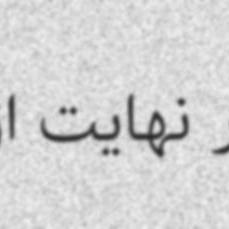

## Persian Font Images Dataset

This dataset contains **68856 images** of Persian text rendered in 16 different fonts. It is designed to train machine learning models such as Resnet and Alexnet to accurately classify Persian font styles.

### Download Link
Click [here](https://drive.google.com/file/d/12Z1bFBPRsEYFswdEMGzyTnthL4xEdZl-/view?usp=drive_link) to download the dataset from google drive.

### Sample Images

### Dataset Details
- Total Images: 68856
  - Train: 55084 images
  - Validation: 6886 images
  - Test: 6886 images

- Image Size: 229 x 229 pixels

- Image Channels: 3 (RGB)

- Image Type: JPEG

- Text Content:

  - Extracted from random sentences in [Persian Wikipedia](https://github.com/miladfa7/Persian-Wikipedia-Dataset) dataset

  - Text cleaning applied to remove non-Persian characters and extra spaces

- Text Position: Horizontally centered

- Background: White

- Text Color: Black

- Image Types:

  - 70% **Clean** images: Just black text on white background
  - 30% **Noisy** images: With random blur, sloping distortion, Gaussian noise
- Fonts: 16 fonts with similar number of images per class:

  - Afsane, Dastnevis, Gandom, Koodak, Mitra, Mosalas
  - Nazanin, Rezvan, Samim, Shabnam, Sogand, Tanha
  - Titr, Vazir, Yasamin, Yekan
- Class Balance: Roughly equal number of images per font class

### Dataset Creation Process
- Text extracted from Persian Wikipedia articles
- Text cleaning to remove non-Persian characters
- 16 fonts selected to represent diverse styles
- Text rendered as images using modified TRFG library
- 70% generated as clean images
- 30% generated with synthetic noise: blurring, distortions, Gaussian noise with varying levels
- Train/Validation/Test split with class balanced stratification

### Usage
This dataset can be used to train machine learning models for:

- Persian optical character recognition
- Font classification and detection
- Text style transfer

The diversity of fonts and synthetic noise allow for training robust models.

The class balancing prevents bias towards any single font style.

The train, validation and test splits allow proper model evaluation.

This dataset is made with python programming language.
